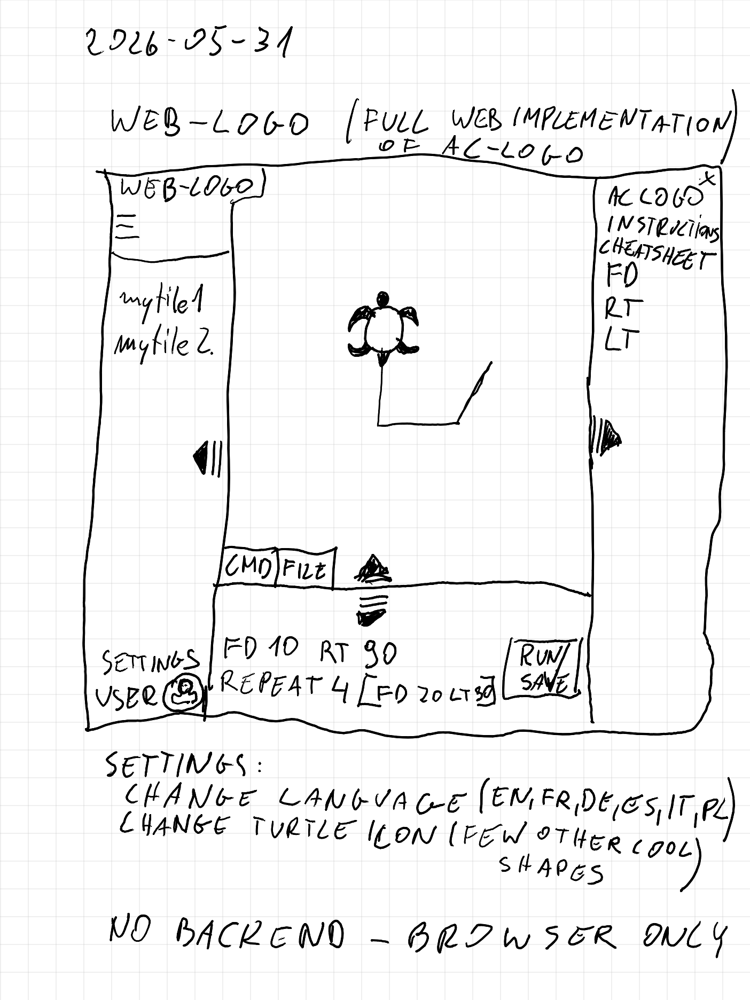
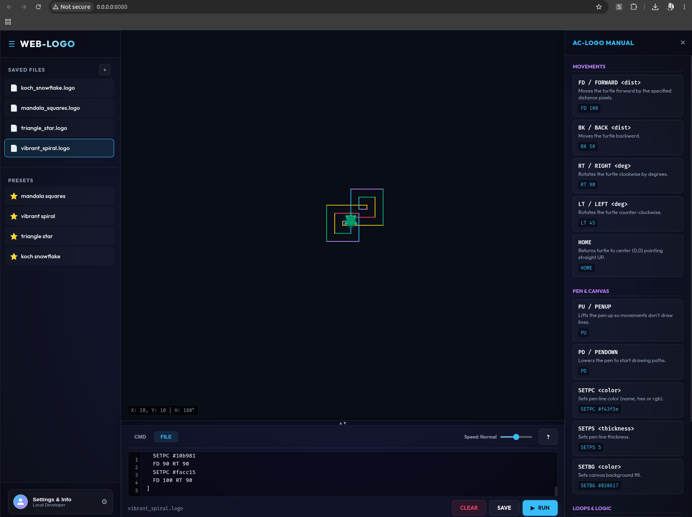

# Web-Logo

Web-Logo is a full web implementation of the AC-Logo interpreter, born from a simple napkin sketch and brought to life using Antigravity.

**Live Demo:** [https://avedave.github.io/web-ac-logo/](https://avedave.github.io/web-ac-logo/)

## History

The project began as a challenge: to transform a hand-drawn concept into a fully functional, browser-based application. The original vision was captured on a piece of graph paper, outlining a workspace for turtle graphics with a command/file editor, a side panel for instructions, and a turtle canvas.

### The Original Sketch


### The Final Implementation
The result is a polished, feature-rich Logo environment that stays true to the initial design while adding modern UI elements and a robust interpreter.



## Features

- **Turtle Graphics:** Full support for standard Logo movements (`FD`, `BK`, `RT`, `LT`).
- **Pen Control:** Customize pen color and size (`SETPC`, `SETPS`, `PU`, `PD`).
- **Interpreter:** Handles commands in real-time or from script files.
- **Modern UI:** Responsive layout with a dedicated manual, file management, and settings.
- **Zero Backend:** Runs entirely in the browser.

## Getting Started

### Prerequisites
No special installation is required as this is a client-side web application.

### Running the Application

#### Option 1: Open Directly
You can run the application by simply opening the `index.html` file in your preferred web browser.
- Locate `index.html` in the project root.
- Right-click and select "Open with..." your browser (Chrome, Firefox, Safari, etc.).

#### Option 2: Local Development Server (Recommended)
For the best experience and to avoid potential browser security restrictions (CORS) when loading local files, it is recommended to use a local web server.

**Using Python:**
```bash
# Python 3
python3 -m http.server 8000
```

**Using Node.js (npx):**
```bash
npx serve .
```

After starting the server, navigate to `http://localhost:8000` (or the port specified) in your browser.

## Built With
- HTML5 / CSS3
- JavaScript (Vanilla)
- [Antigravity](https://antigravity.ai) - The platform used to bridge the gap between sketch and code.
